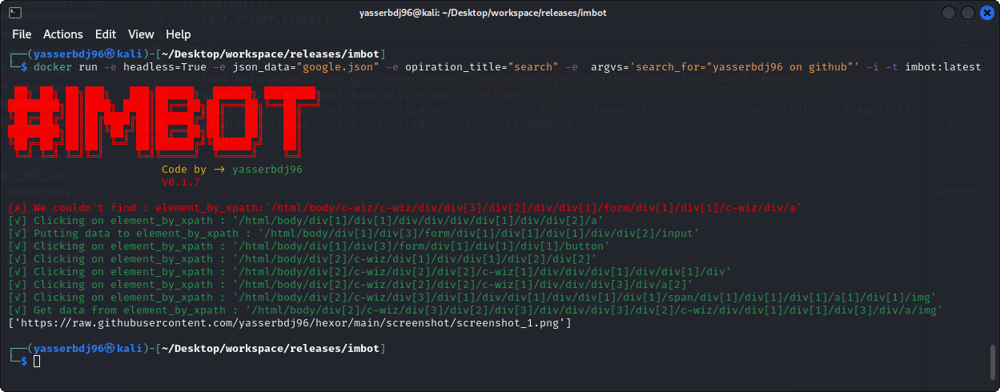

imbot
==========================
imbot for making a bot to control any website.

.. image:: https://travis-ci.com/byRo0t96/imbot.svg?branch=main

Installation
============

.. code::

    pip install imbot

Usage
=====
.. code:: python

    from imbot import imbot

    p1=imbot("<JSON_FILE_PATH>",<TIME_EVERY_OPERATION>)#Get information.
    p1.run("<OPTION>","<DATA>") # Start imbot.
    p1.end() #close.

.. code:: json
{
	"url":"<YOUR_LINK>",
	"<OPTION>":{
		"operations":[
		    {
			    "type":"<FIND_ELEMENT_BY>",
				"code":"<IDENTIFIER>",
				"opt":"click"
			},
			{
			    "type":"<FIND_ELEMENT_BY>",
				"arg_code":"<ORDER_OF_IDENTIFIER_IN run(0,1,2....) FUNCTION>",
				"opt":"click"
			},
			{
			    "type":"<FIND_ELEMENT_BY>",
				"code":"<IDENTIFIER>",
				"opt":"put",
				"data":"THE_DATA_YOU_WANT_TO_ENTER"
			},
			{
			    "type":"<FIND_ELEMENT_BY>",
				"arg_code":"<ORDER_OF_IDENTIFIER_IN run(0,1,2....) FUNCTION>",
				"opt":"put",
				"arg_data":"ORDER_OF_DATA_YOU_WANT_TO_ENTER_IN run(0,1,2...) FUNCTION"
			}
		]
    }
}

Example
=====
.. code:: python

    from imbot import imbot

    # Example:1
    #Open github website, login:
    p1=imbot("github.json")
    p1.run("login",'<USERNAME>','<PASSWORD>')
    p1.end()

    # Example:2
	#Open github website, login & go to your profile:
    p2=imbot("github.json")
	p2.run("login",'<USERNAME>','<PASSWORD>')
	p2.run("profile")
    p2.end()
	
	# Example:3
	#Open github website, login & delete a repository:
	p3=imbot("github.json")
	p3.run("login",'<USERNAME>','<PASSWORD>')
    p3.run("repository_delete",'<USERNAME>/<REPOSITORY_NAME>','<PASSWORD>')
	p3.end()
	
    # Example:4
    #Open github website, login and delete a list of repositories:
	p4=imbot("github.json",5)
	p4.run("login",'<USERNAME>','<PASSWORD>')
	f=open("<REPOSITORIES_LIST.txt>","r").read().split('\n')#type of list is "<USERNAME>/<REPOSITORY_NAME>" in any line
	for x in f:
        p4.run("repository_delete",x,'<PASSWORD>')
    p4.end()

.. begin changelog

Changelog
=========
0.1.0
-----
- New build.

0.0.1
-----
- First public release.

.. end changelog

.. image:: https://ko-fi.com/img/githubbutton_sm.svg
   :target: https://ko-fi.com/L3L34CEPV
